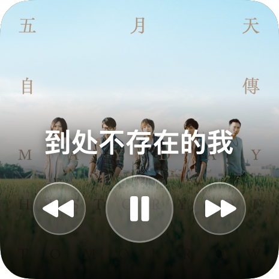

# Apple Music 小组件（macOS）

[English](README.md) · [简体中文](README.zh-CN.md)

Apple 在 macOS 上给 Podcast 做了小组件，却没给「音乐」做。这个项目补上 ——
并且是**第一个在真正的 WidgetKit 小组件里做出丝滑滚动歌词的**，而这件事被普遍认为小组件做不到。

| | |
|:--|:--|
|  |  |
| **小尺寸** —— 整张专辑封面铺到边，底部放歌名和播放控制 | **中尺寸** —— 只有歌词，当前句放大，英文歌带中文翻译 |

## 能做什么

- **丝滑滚动的同步歌词** —— 每句平滑上移、边推边放大，满帧率，就在桌面小组件里
- **英文歌自动带中文翻译**，显示在原文下面
- **实时播放状态** —— 歌名、歌手、专辑、封面，全部来自 Music.app
- **小组件上直接控制播放** —— 上一首 / 播放暂停 / 下一首，不用切 App
- **封面走 Apple 官方的 iTunes 接口**，拿到的就是 Apple Music 里的同一张图

### 关于那个滚动

在 macOS 上做同步歌词的项目不少。我们能找到的每一个，都把它渲染在**窗口**里，而不是小组件里：

| 项目 | 形态 | 滚动发生在哪 |
|---|---|---|
| [Canopy](https://github.com/6gx42o/Canopy) | 刘海播放器 | 自绘的 SwiftUI 窗口 |
| [LyricGlow](https://github.com/ateymoori/lyricglow) | Electron | 置顶窗口 |
| [Vinyl for Mac](https://www.vinylformac.com/) | 悬浮唱机 | 窗口 |
| [Lyrics-Widget](https://github.com/hamedafra/Lyrics-Widget) | 通知中心 | 旧式 widget |

这不是巧合。「小组件不能做动画」是公认常识，所以想要动效的人干脆都去做窗口了 ——
这个项目也走过那条路，又走了回来。

（如果你知道有哪个 WidgetKit 小组件做到了这件事，欢迎开 issue，这个说法会被更正。）

那条常识只对了一半。小组件确实跑不了**持续**动画 —— 每渲染完一帧进程就被挂起。但当时间线
推进时，系统**会**在新旧状态之间做满帧率的插值。歌词换行天然每句都有一个触发点，正好落在
第二类里。让它成立需要两个条件，而且都很容易踩错 —— 见 [做这个项目踩到的坑](#做这个项目踩到的坑)。

播放相关的一切都来自 Music.app 本身。只有歌词和流媒体曲目的封面来自外部，这有硬性原因，见下。

## 安装

需要 macOS 14+、Xcode，以及 [xcodegen](https://github.com/yonaskolb/XcodeGen)（`brew install xcodegen`）。

```bash
git clone https://github.com/linkzhong/apple-music-widget
cd apple-music-widget

# 换成你自己的 Apple Developer Team ID
Tools/set-team-id.sh ABCDE12345

xcodegen generate
xcodebuild -project AppleMusicWidget.xcodeproj -scheme MusicWidgetHost \
  -configuration Release -derivedDataPath build build

cp -R build/Build/Products/Release/MusicWidgetHost.app "/Applications/Apple Music 小组件.app"
open "/Applications/Apple Music 小组件.app"
```

**必须**装到 `/Applications` —— 系统只在那里扫描小组件。首次运行会请求「控制"音乐"」的权限，必须允许。

然后在桌面空白处点右键 →「编辑小组件」→ 找到「Apple Music」→ 拖到桌面上。

**菜单栏那个 App 要一直开着**，关掉小组件就会停在最后状态。建议在它菜单里打开「开机时自动启动」。

## 为什么需要一个后台 App

小组件跑在沙箱里，而沙箱进程不能给 Music.app 发 Apple Event —— 读不到播放状态，更控制不了播放。所以是这个结构：

```
  Music.app
     ↑ Apple Event（读状态 / 控制播放）
  宿主 App（菜单栏，非沙箱）
     ↓ 写 state.json / lyrics.json / 封面
  App Group 共享容器  ← 只有这里能穿透沙箱
     ↓ 读
  小组件（沙箱）
     ↓ 按钮：把指令写回共享容器 + 发通知叫醒宿主 App
```

## 数据从哪来

| 数据 | 来源 |
|---|---|
| 播放状态、歌名、歌手、专辑、进度 | Music.app（AppleScript） |
| 播放控制 | Music.app（AppleScript） |
| 封面（本地文件曲目） | Music.app，`raw data of artwork` |
| 封面（流媒体曲目） | iTunes Search API（Apple 官方），网易云兜底 |
| 歌词 | 网易云 / LRCLIB |

### 歌词和流媒体封面为什么必须走外部源

Apple Music 的歌词和流媒体曲目封面都是**授权内容**，Apple 不通过任何公开接口开放：

- `lyrics` 属性在 Music 的 AppleScript 字典里存在，但对流媒体曲目返回 `missing value`
  （只有你自己导入的文件的 ID3 歌词标签才有值）
- `raw data of artwork` 对流媒体曲目报 `Can't get…`，`data` 报 `Parameter error`

所以唯一的路径是拿 Music 给出的**歌名 + 歌手 + 时长**去公共曲库里匹配同一首歌。

**匹配必须认录音，不能只看名字。** 同一首歌的现场版和录音室版能差几十秒，而歌词时间戳是跟着
**那一次具体录音**走的 —— 版本认错，整首歌从头到尾都对不上。规则是：时长差 8 秒以上直接否决；
从曲名里解析版本标记（现场 / 不插电 / 混音 / 伴奏 / 翻唱），原曲和候选必须完全一致。
分数不够就什么都不显示 —— 挂一整首对不上的歌词，比空着更糟。

## 做这个项目踩到的坑

不显然的部分，记在这里是因为每一条都花了实打实的时间。

**小组件做不了持续动画，但做得了过渡动画。** 小组件不是持续渲染的视图，而是「静态快照 +
定时替换」，每渲染完一帧进程就被挂起，`.repeatForever`、`withAnimation`、
`TimelineView(.animation)` 统统不跑。但时间线推进时，系统**会**在新旧状态之间做满帧率插值。
歌词滚动属于后者，所以它能丝滑。

**要拿到滚动，每一行必须在窗口滑动时保持稳定身份。** `ForEach` 的 id 要用**全曲行号**，
不能用窗口内的下标。窗口往下滑一格时，留下来的那几句 id 必须不变，系统才认得出
「这句从下面移上来了」，否则只会把整块内容淡入淡出掉。

**字号和字重都不是可动画属性。** 用 `.font()` 的大小差别来突出当前句，会在过渡中途硬跳一下 ——
位置在平滑移动、字号却「啪」地切换，看起来就成了「旧的消失、新的凭空出现」。主次必须靠
`scaleEffect` 和 `opacity` 表达，这两个才补得出来。这个坑会咬两次：先是字号，改完之后字重
还会以「推上去半秒后才粗一丢丢」的形式再出现一次。

**所有尺寸按容器比例取，不要写死点数。** 小组件的真实画布并不等于文档上的 155×155，写死的
留白会跟着画布漂 —— 症状是按钮贴在底边上。

**背景是封面自己糊出来的。** 照 Apple Music 本体的做法：不是提取主色排成渐变，而是把封面
复制几份、各自缩放旋转叠起来，再强模糊 + 过饱和。取色方案遇到灰调封面会糊成一坨脏灰，这个不会。
两个细节：模糊半径必须跟着容器尺寸走（写死会把整块糊成一个平均色）；模糊前要让图层溢出边界一圈，
否则 `blur(opaque:)` 会把边缘像素往外拉，四条边各留一道色带。

**歌词时间线整体提前 0.6 秒。** 系统不会精确在 entry 的时间点重绘，实测滞后半秒到一秒。
判断「当前是第几句」时要用同样的偏移，两边必须一致。

**封面按专辑缓存，不按曲目。** 一张专辑的每首歌本来就共用一张封面，按曲目存的话每换一首都要
重新跑网络。哈希要用固定算法而不是 `hashValue` —— 后者带随机种子，每次启动都变，缓存会全部失效。

**封面只下 300×300。** 小组件最大 155pt，在 2 倍屏上是 310 像素，600 的图体积是四倍，
换来的清晰度是零。

**署名行要从歌词里剥掉。** 网易云的 LRC 开头那几行作词作曲信息**同样带时间戳**，不滤就会被
当成第一句歌词高亮出来。只从开头连续地剥、碰到第一句真歌词就停，否则会误伤正文里带冒号的句子。

**长前奏时要把开头几句都摆出来。** 有些歌二十多秒才开唱，那段时间里只显示一句暗字，
看着和「没找到歌词」一模一样。

## 为什么没有黑胶唱片

做过，最后删了，原因值得记下来。

黑胶在小组件里转不起来 —— 原因见上面那条动画笔记。靠时间线硬推的话每 3 秒重绘一次，
那是在跳格，不是在转。

这不是能力问题。这个品类做得最好的 [Vinyl for Mac](https://www.vinylformac.com/) 是悬浮窗 App；
App Store 上那些黑胶小组件（MD Vinyl、VinylPod、MS Vinyl）的旋转全都发生在**打开 App 之后**的
界面里 —— 收费做到品类第一的 MD Vinyl，有用户反馈的正是这句：点开 App 能看到唱片转，
但小组件本身不转。

悬浮窗版本也做过，`TimelineView(.animation)` 在那儿确实能 60fps 真转，但窗口浮在桌面上会和
图标、壁纸搅在一起，显得乱；小组件在系统的格子里排列，整体性好得多。于是退回小组件、接受不能动。

而不能动的黑胶在 155pt 里就没有存在理由了：唱片直径只剩 92pt、中心封面 34pt，认不出是哪张专辑，
沟槽和唱臂的质感在这个尺寸下也看不清。换成整张封面铺满，反而是把唱片公司设计好的作品完整呈现出来。

## 关于液态玻璃

小组件能不能是半透明的玻璃？能，但开关不在代码里 —— 在
**系统设置 → 外观 → 「图标与小组件样式」→「透明」**。那是个全局设置，会一起影响所有图标和小组件。

代码这边要做的是**不要画自己的不透明背景**，否则会盖掉系统给的玻璃。macOS 26 的 `glassEffect`
API 在这里用不了：它需要实时采样背后的画面，而小组件是离屏渲染的，拿不到 backdrop。实测下来
不但玻璃没出现，连它底下的填充都被一起吃掉，按钮只剩一个裸图标。所以控制键的玻璃质感是手绘的：
半透明的体积 + 上亮下暗的描边（这条边是「有厚度」的关键）+ 顶部反光 + 外阴影。

## 调视觉用的离屏预览

改小组件样式最烦的是看不见效果 —— 得反复往桌面上加删。项目里带了个预览工具，
用**小组件同一份视图代码**把两个尺寸渲染成 PNG：

```bash
xcodebuild -project AppleMusicWidget.xcodeproj -scheme MusicWidgetPreview \
  -configuration Release -derivedDataPath build build
./build/Build/Products/Release/MusicWidgetPreview <输出目录> [封面图路径]
```

两个已知差异，都只影响预览、不影响真实小组件：

- `containerBackground` 是 WidgetKit 专有的，预览里改用普通 `.background`
- `ProgressView` / `Text` 的 `timerInterval` 版本底层是 AppKit 控件，`ImageRenderer` 渲染不出来
  （会画成一条黄色警示条），预览里换成自绘的静态条

视图靠 `familyOverride` 区分这两种场景：真实小组件不传，预览工具传。

**深浅两种封面都要试** —— 底部那层压暗的渐变必须同时扛住浅色封面（白字容易糊）和深色封面
（容易压成一团黑）。

## 重新构建后小组件没变化？

`chronod`（渲染桌面小组件的进程）会缓存旧的 extension，光替换 App 不生效：

```bash
lsregister -f "/Applications/Apple Music 小组件.app"
pkill -f MusicWidgetExtension
killall chronod
```

`lsregister` 的完整路径在
`/System/Library/Frameworks/CoreServices.framework/Frameworks/LaunchServices.framework/Support/`。

## 已知限制

- 宿主 App 不运行时小组件不更新（会显示提示，点一下能把它拉起来）
- 冷门歌、或者 Apple Music 独有的现场版本，可能匹配不到歌词或封面
- 歌词有固定偏移时无法自动校正：LRC 的时间戳是按公共曲库那版母带打的，如果 Apple Music 的版本
  开头静音长度不同，整首会差一个固定值
- 桌面被全屏窗口盖住时小组件不刷新，这是 macOS 的行为

## 相关项目

同样的需求，不同的形态 —— 它们全都是窗口而不是小组件，这正是开头那段说的：

- [Canopy](https://github.com/6gx42o/Canopy) —— 刘海播放器，同步歌词渲染在自绘的 SwiftUI 窗口里
- [LyricGlow](https://github.com/ateymoori/lyricglow) —— Electron 置顶歌词窗
- [Vinyl for Mac](https://www.vinylformac.com/) —— 照片级唱机，悬浮窗
- [Lyrics-Widget](https://github.com/hamedafra/Lyrics-Widget) —— 通知中心的歌词小组件

这个项目是原生 WidgetKit 桌面小组件、歌词滚动丝滑、中文曲库优先，并且英文歌带中文翻译。

## License

MIT
